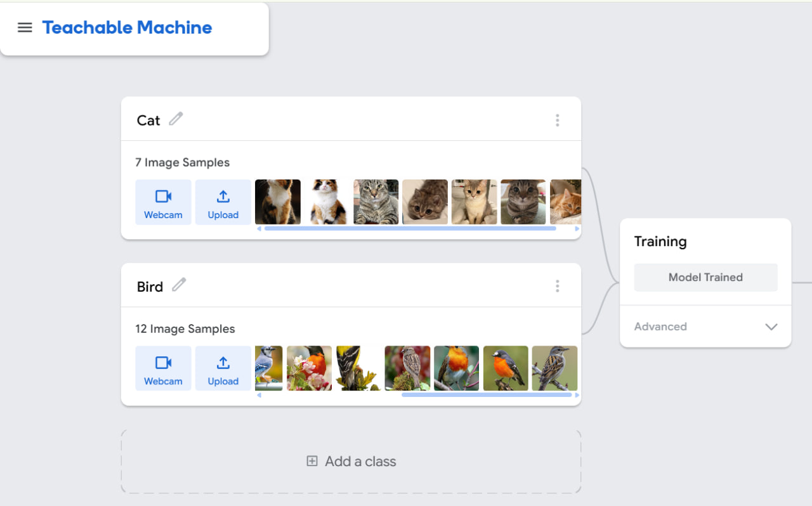
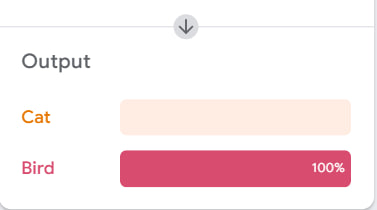
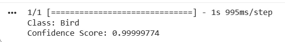

# Bird & Cat Image Classification with Google Teachable Machine

## Project Overview

This project demonstrates an image classification model built using Google Teachable Machine. The model was trained to classify images into two categories: Bird and Cat. After training, the model was exported in TensorFlow/Keras format and tested using Google Colab with Python.

---

## Image Classes

- Class 1: Bird
- Class 2: Cat

---

## Tools & Technologies

- Google Teachable Machine
- TensorFlow / Keras
- Python
- Google Colab
- NumPy
- Pillow (PIL)

---

## Teachable Machine

The model was trained using Google Teachable Machine with two classes: Bird and Cat. After training, the preview feature was used to test a bird image, and the model correctly predicted it as Bird with 100% confidence.

| Training Model | Test Image | Prediction |
|:--------------:|:----------:|:----------:|
|  |  |  |

---

## Google Colab

The exported TensorFlow/Keras model was loaded into Google Colab using Python. The notebook loads the trained model, processes the input image, and predicts its corresponding class.

| Google Colab Notebook | Prediction Result |
|:----------------------:|:-----------------:|
|  |  |

---

## Repository Contents

- keras_model.h5 – Trained TensorFlow/Keras model.
- labels.txt – Class labels.
- Untitled0.ipynb – Google Colab notebook.
- download (5).jpeg – Test image.
- screenshots/ – Project screenshots.
- README.md – Project documentation.

---

## Conclusion

This project demonstrates a complete image classification workflow using Google Teachable Machine and Google Colab. The model was successfully trained with two classes (**Bird** and Cat**), exported in TensorFlow/Keras format, and tested using Python. The final prediction correctly classified the input image as **Bird with a confidence score of approximately 99.99%.
